# U-Tender User Manual — Getting In and Getting Around

This manual covers the basics: opening U-Tender, creating an account, logging in and out, recovering a password, verifying your account, and moving around as an **Owner**, a **Service provider** or an **Admin**.

Every screenshot was taken with Playwright, which drove the real application in a browser like a user would.
- **Data:** the demo data from `backend/scripts/seed_kuwait_demo.py`.
- **Screen sizes:** desktop at 1280 px wide, plus a few screens at phone width (390 px).
- **Passwords:** always masked in the screenshots.

---

## 1. Getting started

**Application URL**

| Where | URL |
|---|---|
| Local development (this walkthrough) | `http://localhost:5173` (the API runs at `http://localhost:8000`) |
| A deployed site | The address your administrator gives you (`deploy.sh` prints it) |

In the steps below, `{APP}` means that address.

**Who uses U-Tender**

| Role | Who | What they do |
|---|---|---|
| **Owner** | A landowner, project owner, buyer or organisation with work to be done | Posts *projects* (requirements) with drawings and a deadline, receives offers, evaluates them, awards one |
| **Service provider** | A contractor or company | Finds open projects, reviews drawings and scope, submits offers |
| **Admin** | U-Tender staff | Reviews applications, manages documents, categories, website content and moderation |

Each account is either an Owner or a Service provider. Admin accounts can't be created through sign-up.

**Words you'll see**
- **Project / requirement:** what an owner posts for providers to price.
- **Offer / bid:** a provider's priced response to a project.
- **Verification:** before posting projects (owners) or bidding (providers), you upload documents and an admin approves them.
- **Sealed:** a project whose offers stay hidden from the owner until the deadline.
- **EN / عربي:** the language switch at the top of every page. The whole interface is in English and Arabic.

---

## 2. Login

### Step 2.1 — Open the login page

**Visit URL:** `{APP}/` and click **Log in** at the top right, or go straight to `{APP}/login`.

**What you see:** the U-TENDER logo, the language switch, and a short form with **Email** and **Password**. Below it are a **Forgot password?** link, the orange **Log in** button and a **Sign up** link.

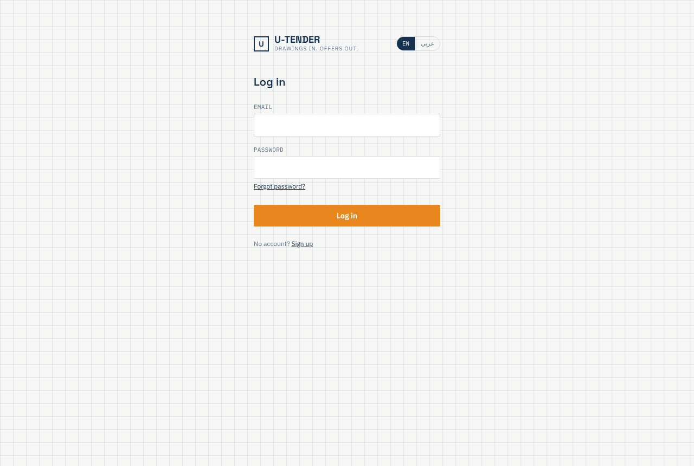

### Step 2.2 — Log in

**Do this:**
1. Enter your email, for example `owner.alsabah@example.com`.
2. Enter your password. It is masked as you type.
3. Click **Log in**.

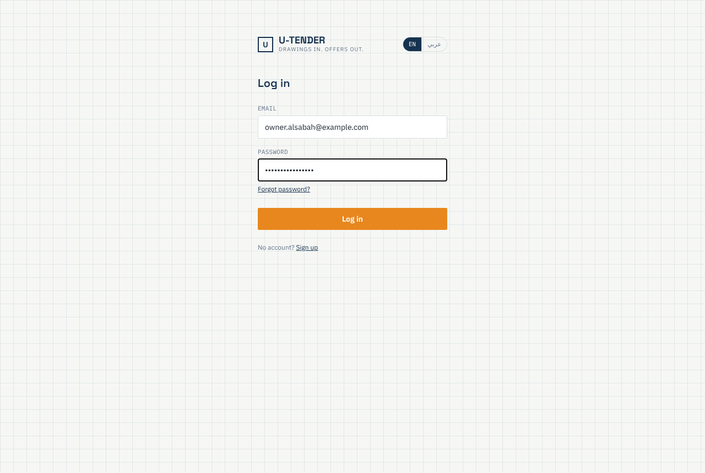

**Expected result:** you go straight to your own starting page:

| Your account | Where you land |
|---|---|
| Approved owner | **Your projects** (`/owner/dashboard`) |
| Owner still waiting for approval | **Application status** (`/owner/status`) |
| Owner who hasn't finished verification | **Verify your account** (`/owner/verify`) |
| Service provider (any state) | Your provider dashboard (`/service-provider/dashboard`) |
| Admin | **Required documents** (`/admin/requirements`) |

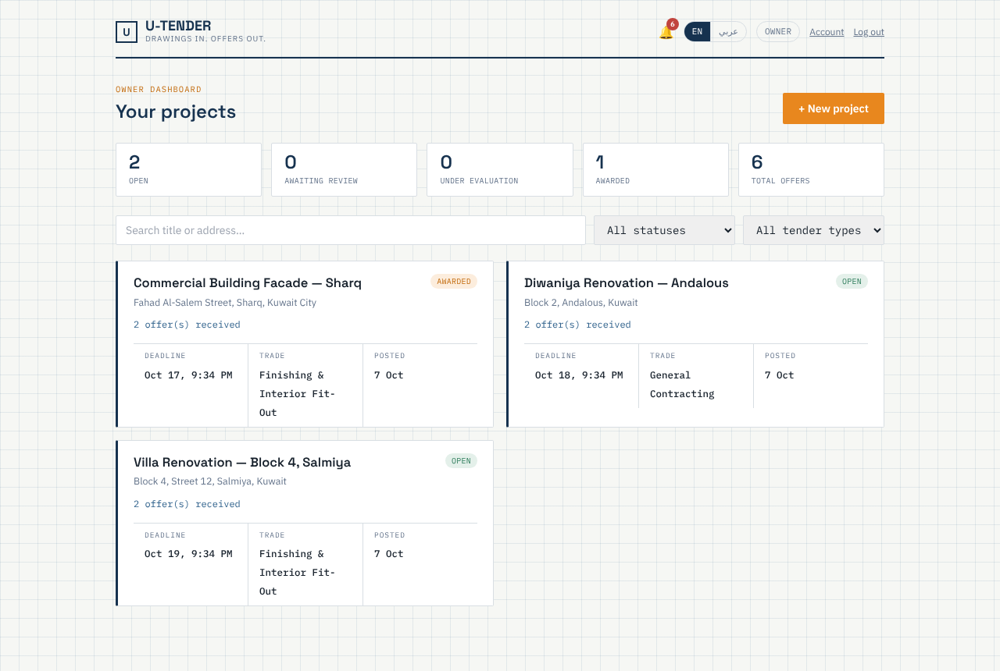

### Step 2.3 — If the login fails

**What you see:** a red box saying **"Invalid email or password."** Your email stays filled in, the password field is still there, and you can simply try again. The message doesn't say which of the two was wrong.

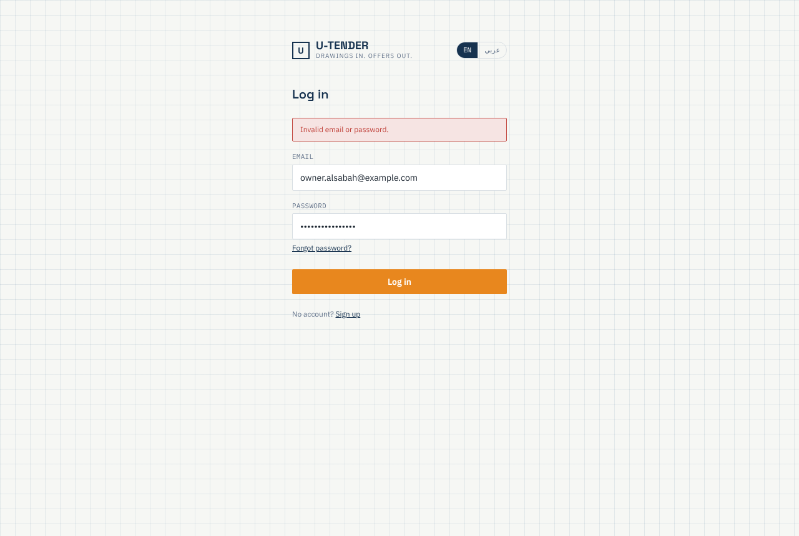

**Do this:** re-type the password and click **Log in** again, or use **Forgot password?** (section 4).

---

## 3. Registration (sign up)

### Step 3.1 — Start from the home page

**Visit URL:** `{APP}/`

**What you see:**
- **Top of the page:** the headline "Post a project. Get real offers.", **Sign up** and **Log in** buttons, and live counts (open tenders, verified service providers, projects awarded).
- **"Which side are you on?"** compares the two roles. Each card lists what you'll do, the verification documents you'll upload and the cost: free for owners, a subscription for providers to open full drawings and bid.

**Do this:** click **Sign up as an Owner** or **Sign up as a Service provider**. The role is then already chosen on the next page. The plain **Sign up** button lets you choose it there instead.

### Step 3.2 — Choose your role

**Visit URL:** `{APP}/signup`

**What you see:** **Create an account**, with **I am a…** offering **Owner** and **Service provider**, and then **Full name**, **Email** and **Password**.

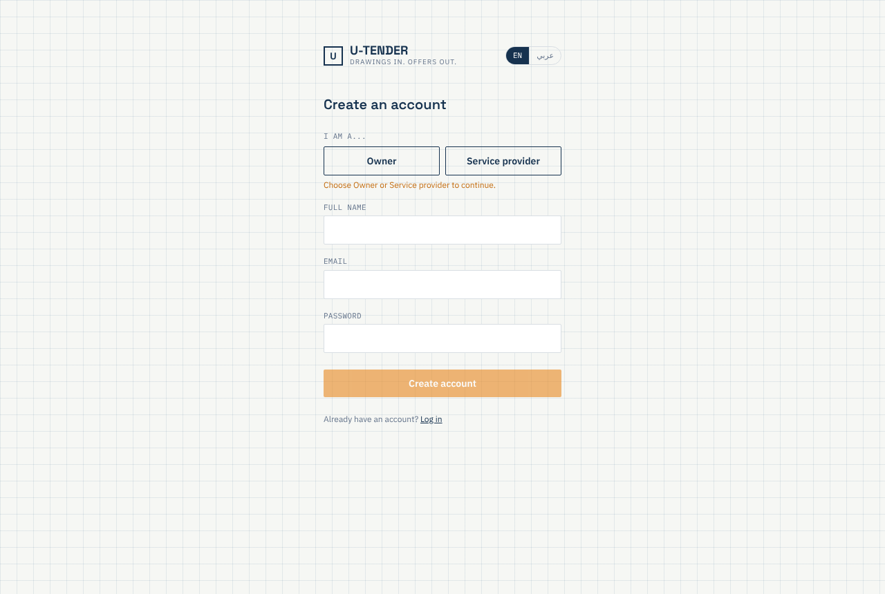

**Do this:** click **Owner** or **Service provider**. The choice is shown under **Signing up as** with a **Change** link, plus a one-line reminder of what comes next.

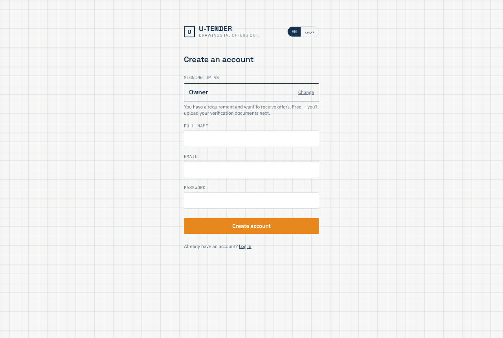

### Step 3.3 — Fill in the form

**Do this:**
1. **Full name**, for example `Noura Al-Saleh`.
2. **Email**: the address you'll log in with.
3. **Password**.
4. Click **Create account**.

All three fields are required. If one is empty, the browser points to it ("Please fill out this field.") and nothing is sent.

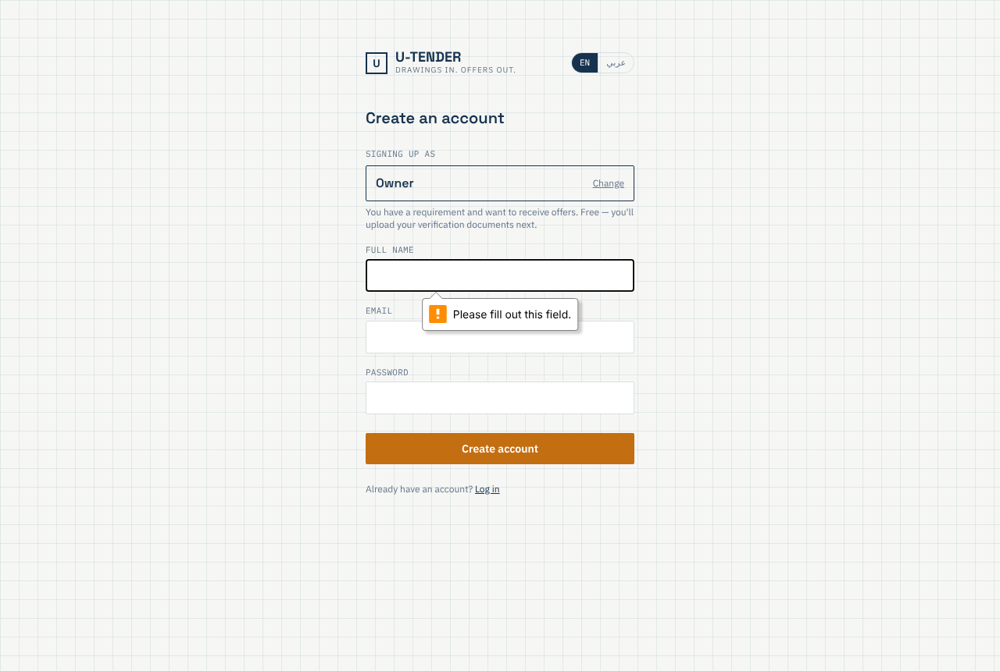

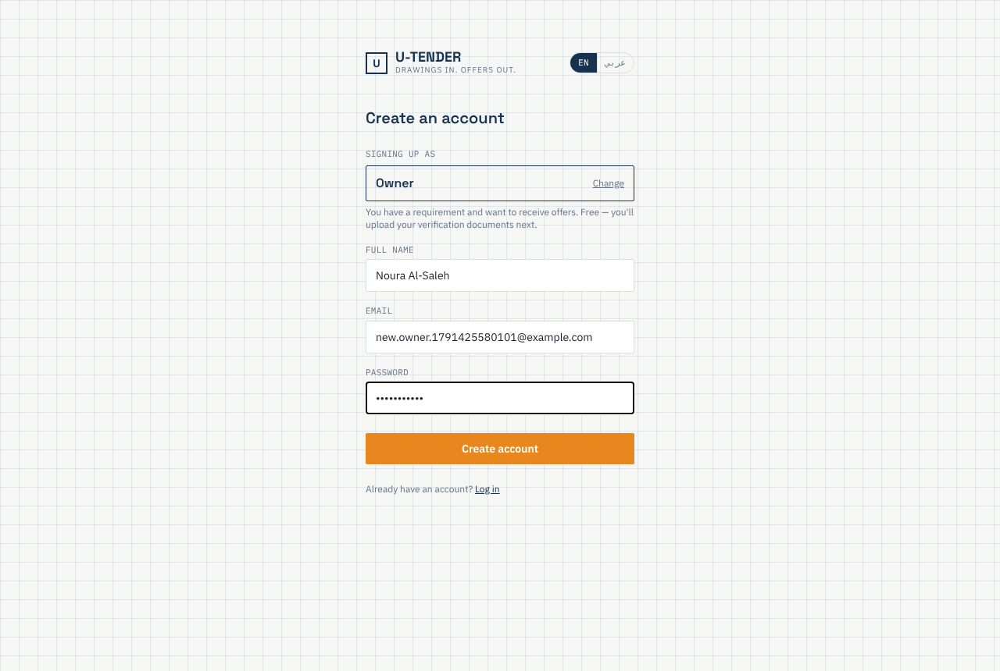

**Expected result:** your account is created and you're signed in. You go straight to **Verify your account**: `/owner/verify` for owners, `/service-provider/verify` for providers. See section 6 and section 7.

U-Tender also sends a confirmation email at this point (see section 5).

---

## 4. Password recovery

### Step 4.1 — Ask for a reset link

**Visit URL:** `{APP}/login` → **Forgot password?** (or `{APP}/forgot-password`)

**What you see:** **Reset your password**, with one **Email** field and **Send reset link**.

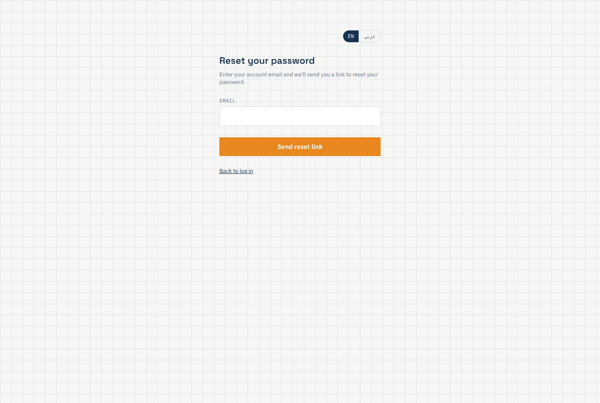

**Do this:** enter your account email and click **Send reset link**.

**Expected result:** "If an account with that email exists, a reset link has been sent." The message is the same whether or not the email is registered, so it can't be used to check who has an account. A **Back to log in** link takes you back.

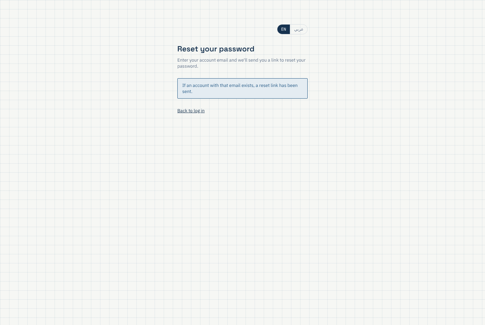

### Step 4.2 — Choose a new password

**Visit URL:** the link in the email, which opens `{APP}/reset-password?token=…`

**What you see:** **Choose a new password**, with one **New password** field and **Reset password**.

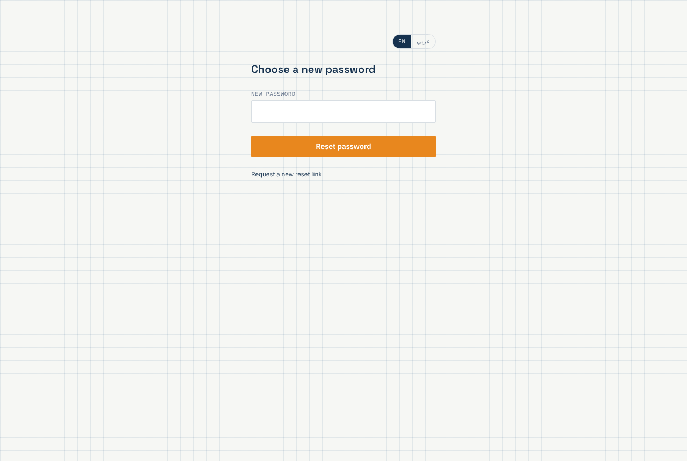

**Do this:** enter a new password and click **Reset password**, then log in with it.

> **Requires email delivery.** The reset link only arrives where outgoing email is configured (`RESEND_API_KEY`). In the environment used for this manual, email isn't configured, so the screen was opened directly and the final reset wasn't completed.

---

## 5. Email verification

After you sign up, U-Tender emails a link to confirm your address.
- **Where to see it:** until you confirm, your **Account** page has a **Resend verification email** button (section 9).
- **Do this:** open the emailed link. It opens `{APP}/verify-email?token=…`, which confirms your address.

**If the link is old or wrong**, you see: "This verification link is invalid or has expired." Request a new one from **Account → Resend verification email**.

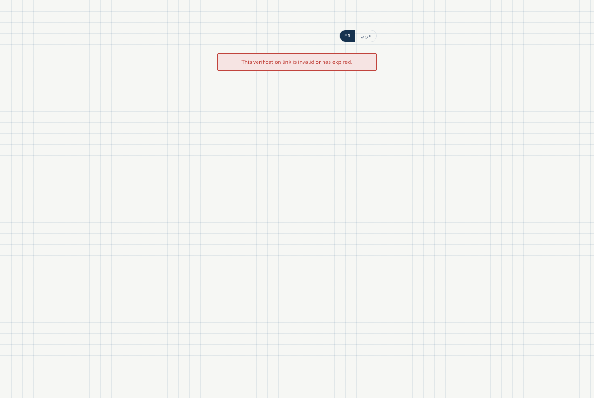

> **Requires email delivery.** As with password reset, the link only arrives where outgoing email is configured. Here only the invalid-link screen could be shown; a successful verification wasn't demonstrated. Email confirmation is separate from the document verification in sections 6 and 7, which is what unlocks posting and bidding.

---

## 6. Owner — getting started

### Step 6.1 — Verify your account (new owners)

**Visit URL:** `{APP}/owner/verify` (you land here after signing up)

**What you see:** **Verify your account**, in three parts:
1. **Who does this account represent?**
   - **Myself:** a landowner, project owner or buyer acting personally.
   - **An organization:** a company, government body or other organisation you're authorised to act for.
   - Then **Continue**.
2. A **Verification** box showing your progress, for example *Not started*.
3. The **documents** to upload, each with **Choose File**, for example **Land Ownership Proof** and **Civil ID**. The list is set by the admin. At the bottom is **Submit for review**.

**Do this:**
1. Choose **Myself** or **An organization** and click **Continue**.
2. Upload each required document.
3. Click **Submit for review**. It stays disabled, with a note, until step 1 is answered.

**Expected result:** **Application status** shows your application under review. You're notified when an admin decides.

If you leave before submitting, you come back to this page the next time you log in:

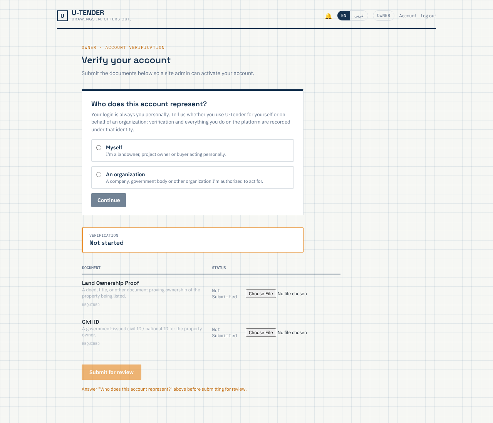

### Step 6.2 — Waiting for approval

**Visit URL:** `{APP}/owner/status`

**What you see:** **Application status**, the date you submitted, and each document's status. Any document that needs attention has an **Upload** button. Project pages stay locked until you're approved.

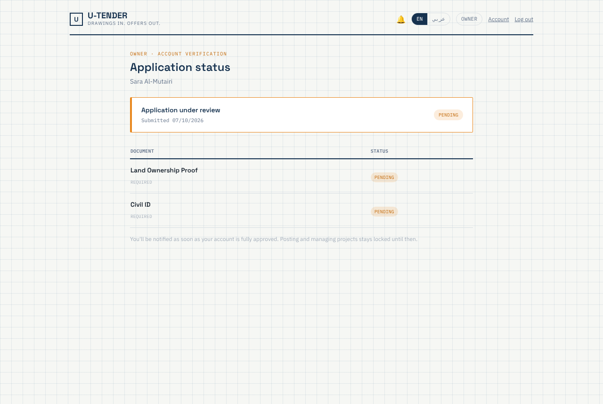

Once approved, the same page says **"You're approved — Head to your dashboard to post a project."** Use the **U-TENDER** logo at the top left to get there.

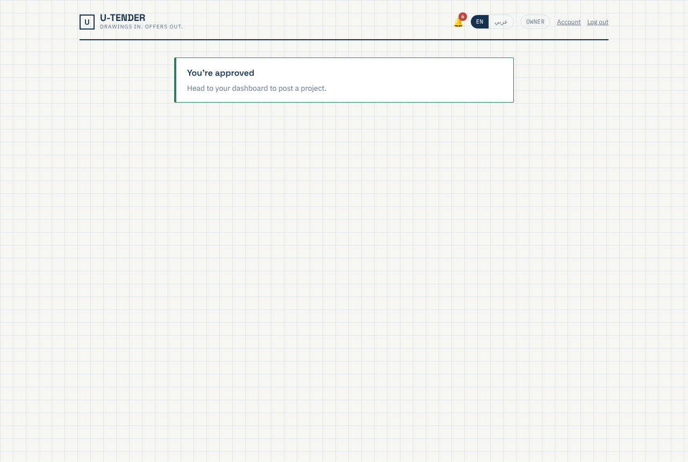

### Step 6.3 — Your projects (dashboard)

**Visit URL:** `{APP}/owner/dashboard`

**What you see:**
- **Header** (on every owner page): the **U-TENDER** logo (back to this dashboard), the 🔔 notification bell with your unread count, **EN / عربي**, an **OWNER** badge, **Account** and **Log out**.
- **Your projects**, with an orange **+ New project** button.
- **Counts:** open, awaiting review, under evaluation, awarded and total offers.
- **Search and filters:** a search box and **All statuses** / **All tender types**.
- **Project cards:** one per project, with its status (OPEN, AWARDED…), address, offers received, deadline, trade and posted date.

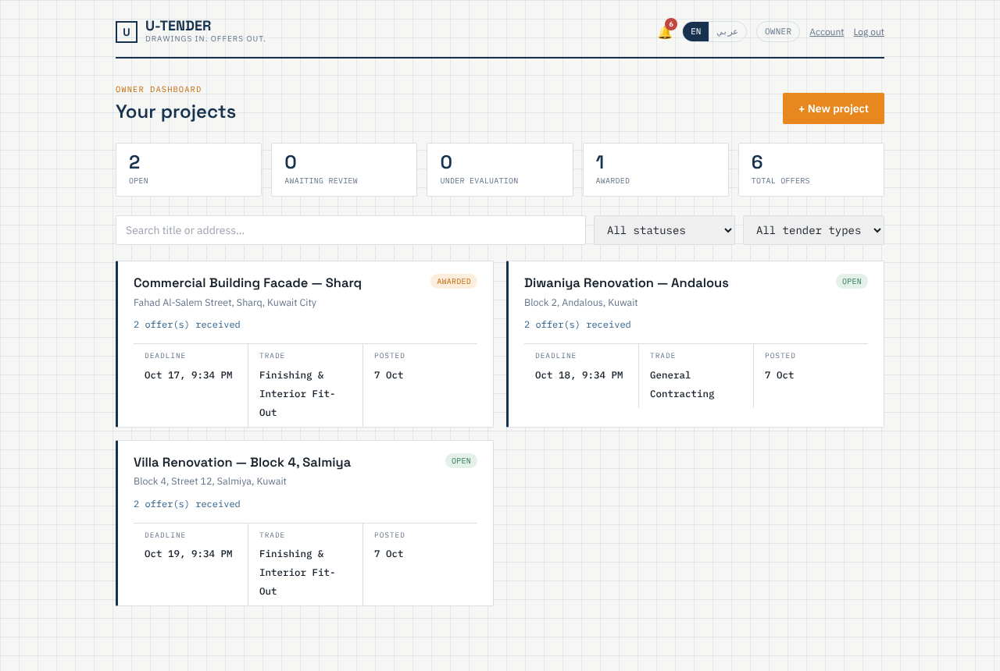

### Step 6.4 — Post a new project

**Do this:** click **+ New project** (`/owner/projects/new`).

**What you see:** **Post a project**, with:
- title, governorate, area and address;
- trade;
- the scope of work;
- drawings;
- the bid deadline;
- **OWNER-VISIBLE / SEALED**: whether you see offers as they arrive or only after the deadline.

At the bottom are **Post project** and **Save as draft**. A **Before you post** panel lists what's still missing.

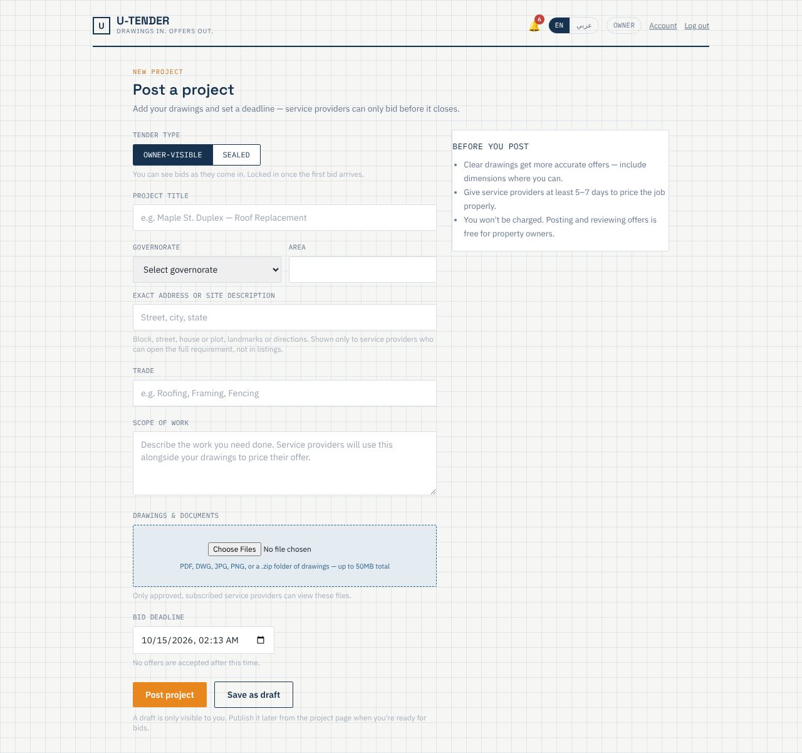

To leave without posting, use the browser's Back button or the **U-TENDER** logo.

### Step 6.5 — Open a project

**Do this:** click a project card on the dashboard (`/owner/projects/{id}`).

**What you see:**
- the project's details, scope and documents, and its questions and answers;
- once offers arrive, **Review offers**: each offer with **View offer** and a **Compare** checkbox;
- **Compare selected**, and your private evaluation notes.

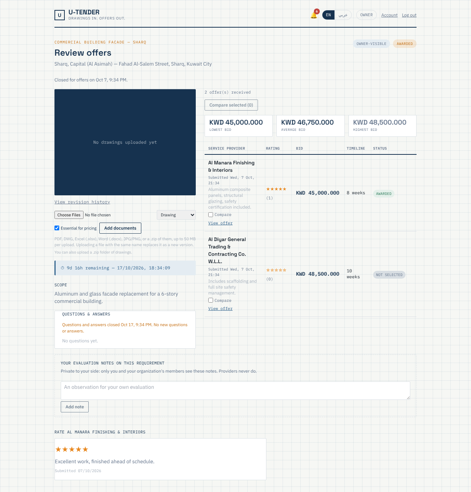

Back: the **U-TENDER** logo, or the browser's Back button.

---

## 7. Service provider — getting started

### Step 7.1 — Sign up and verify

Sign up as a **Service provider** (section 3). You land on `/service-provider/verify`. It works like the owner's page (section 6.1), with company documents such as the **Commercial License** and **Chamber of Commerce Certificate**. Choose who the account represents, upload the documents and click **Submit for review**.

### Step 7.2 — Your dashboard

**Visit URL:** `{APP}/service-provider/dashboard` (where every provider lands after logging in)

**What you see while your application is under review:**
- your company name;
- a blue **Application under review** banner with **View submission**;
- **Your services**: the types of work you offer and the governorates you serve, with **Save services**.

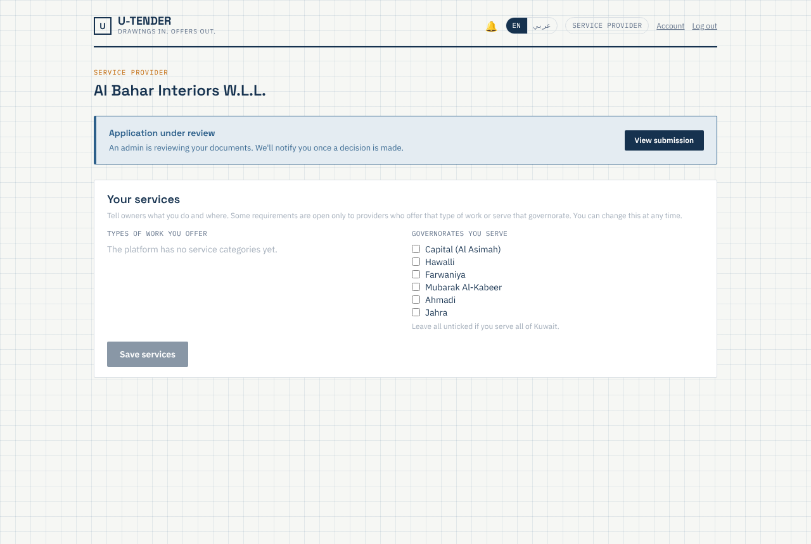

**What you see once approved:** your services, plus:
- **Counts:** **Active bids**, **Projects won**, **Total bids placed**;
- **My bids:** each offer with its status (BID PLACED, NOT SELECTED, AWARDED…), your price and the project's state;
- **Browse open projects**, which links to the feed.

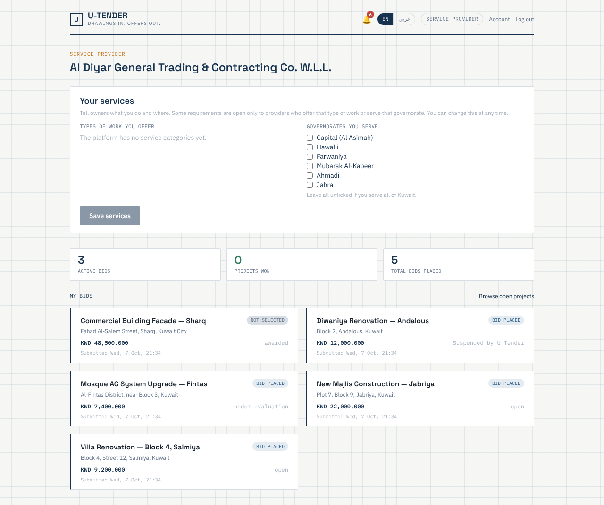

### Step 7.3 — Find projects (feed)

**Do this:** click **Browse open projects** (`/service-provider/feed`).

**What you see:**
- **Projects open for bidding**, sorted by closing soonest.
- **Filters:** search, trade, governorate, time left and sort; plus the checkboxes **My types of work**, **My service areas** and **Accepting offers now**.
- **Project cards:** deadline (Kuwait time), trade, how it's priced, offers so far ("Sealed offers" when sealed), and **☆ Save**.

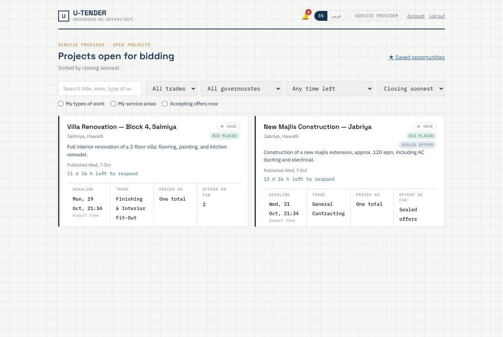

**Saved projects:** **★ Saved opportunities** at the top right (`/service-provider/saved`). **Back to all opportunities** returns to the feed.

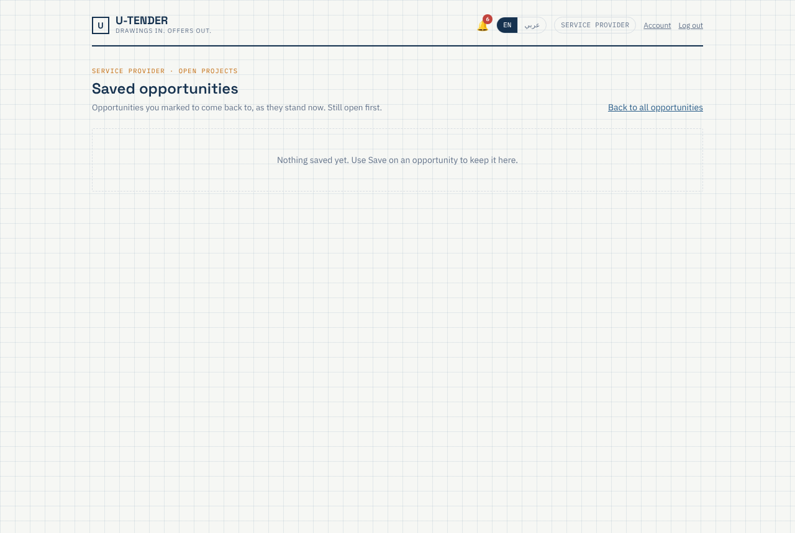

### Step 7.4 — Open a project

**Do this:** click a project card in the feed, or an entry under **My bids** (`/service-provider/projects/{id}/offer`).

**What you see:**
- the scope, documents and rules for this opportunity, and what your offer must include;
- **Questions & answers**, with **Ask**;
- your offer form (price, completion period, start and completion, documents), or your submitted offer with **Update offer** and **Withdraw offer**.

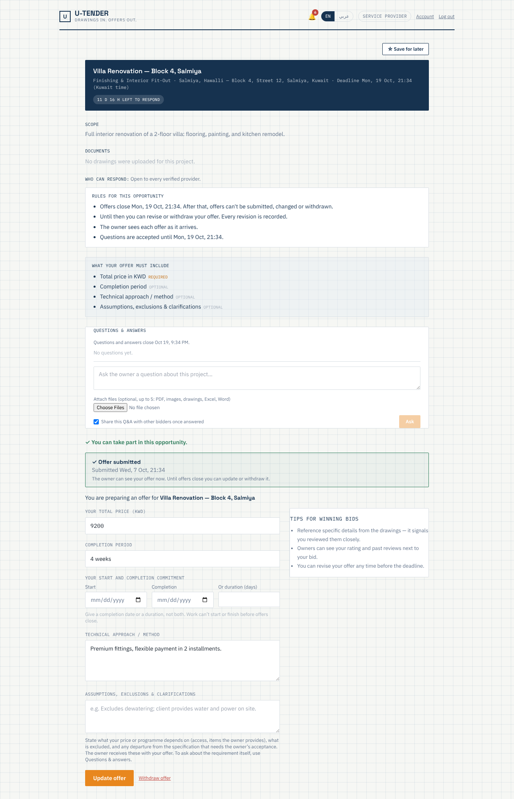

Back: the **U-TENDER** logo returns to your dashboard.

### Step 7.5 — Verification status

**Visit URL:** `{APP}/service-provider/status`, also opened by **View submission**. It shows your application and document statuses, or "You're approved" once approved.

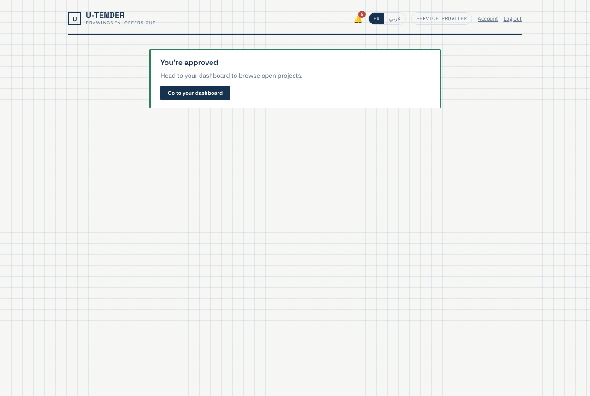

---

## 8. Admin — basic navigation

Admin accounts are created by promoting an account in the database (see the README, "Create your first admin"). After logging in, an admin lands on **Required documents** (`/admin/requirements`). A menu on every admin page links to each area:

| Menu item | URL | What it's for |
|---|---|---|
| Document requirements | `/admin/requirements` | The documents owners and providers must upload |
| Categories | `/admin/categories` | Service categories (types of work) |
| Review applications | `/admin/review` | Approve, request corrections on or reject applications |
| All service providers | `/admin/service-providers` | Every provider, including suspended ones |
| All owners | `/admin/owners` | Every owner |
| All projects | `/admin/projects` | Every project, with moderation |
| All offers | `/admin/offers` | Every offer, grouped by project |
| Website content | `/admin/cms` | Home page text, in English and Arabic |

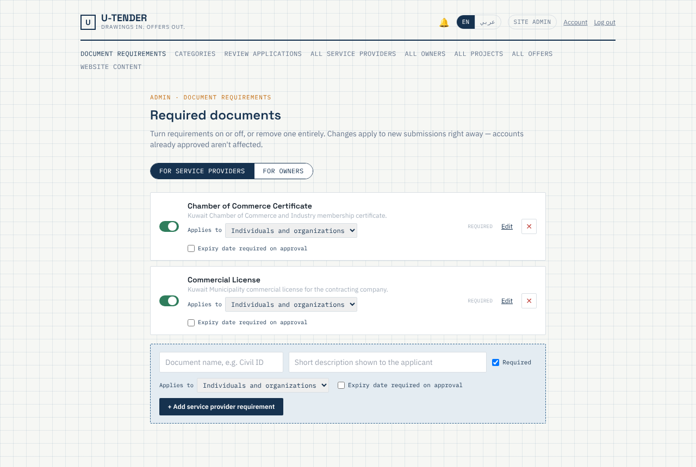
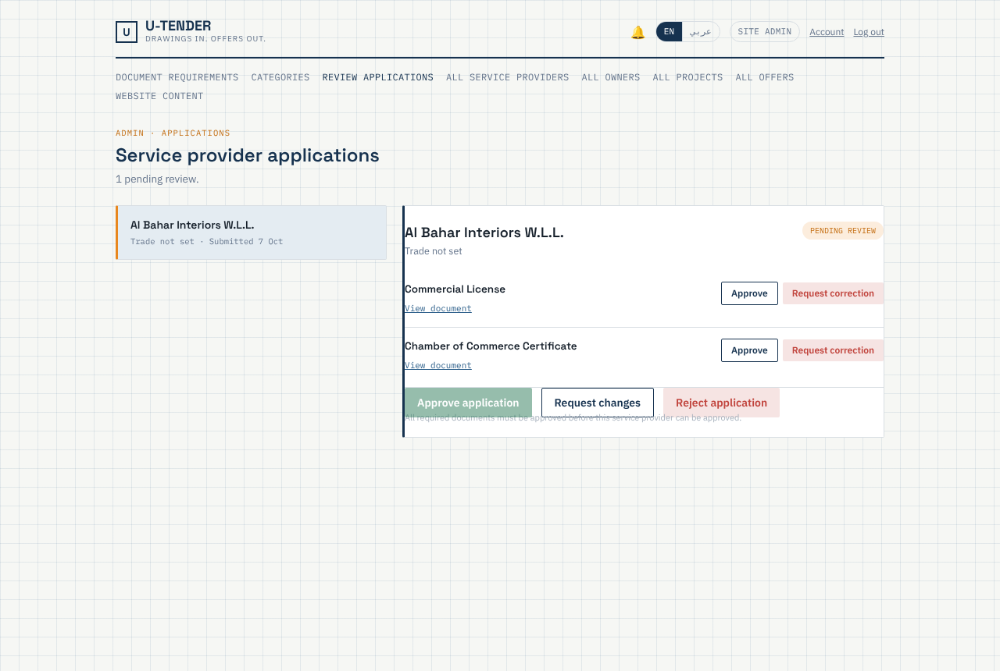
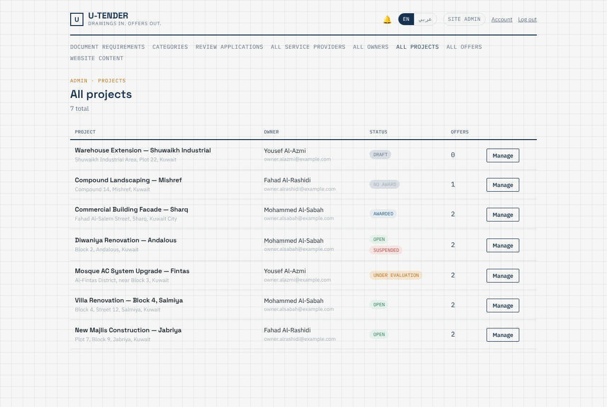
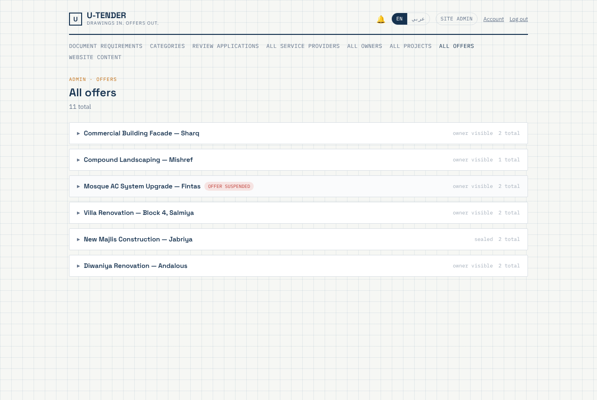

For this manual the admin pages were only opened; nothing was approved, edited or deleted.

---

## 9. Account & logout

### Step 9.1 — Account

**Do this:** click **Account** in the header (`/account`).

**What you see:**
- **Who does this account represent?**
- **Resend verification email**, if your email isn't confirmed yet;
- for an organisation, **Organization members** with **Send invitation** (invite colleagues by email);
- **Change password**: current and new password.

Refreshing the page keeps you signed in.

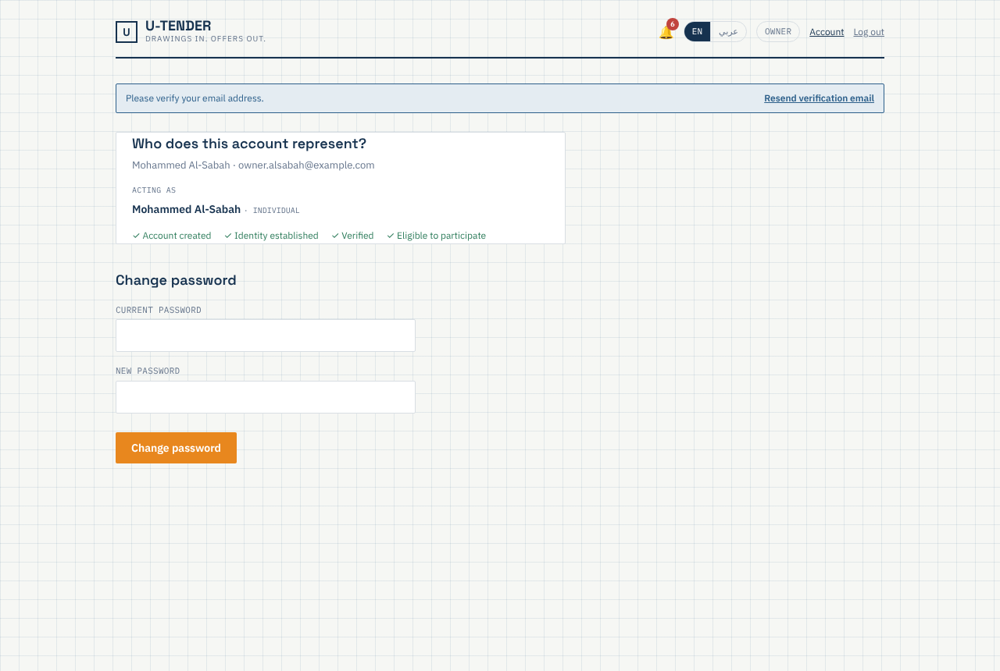

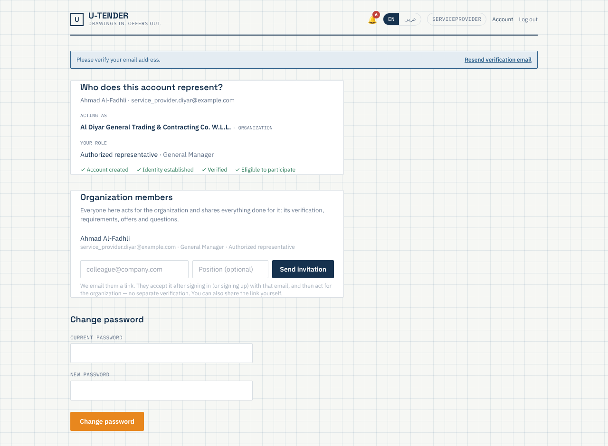

### Step 9.2 — Log out

**Do this:** click **Log out** in the header.

**Expected result:** you're back on the public home page, signed out.

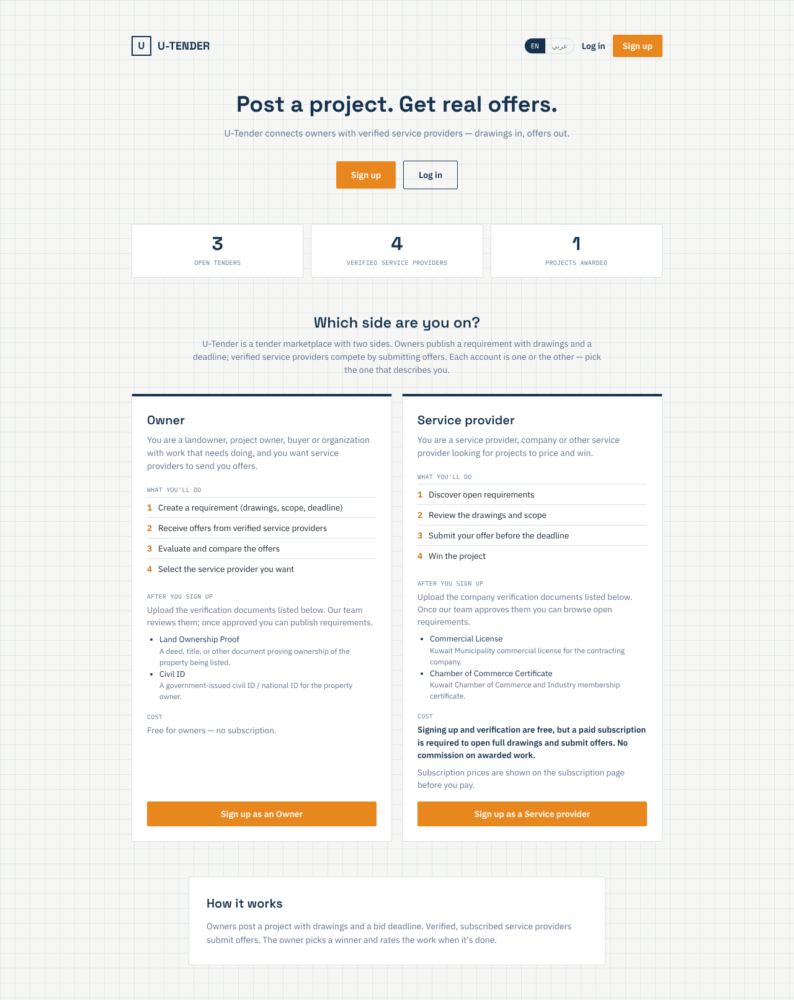

**Safety checks (verified):**
- Pressing the browser's **Back** button after logging out doesn't show the page you were on. You're sent to **Log in**.

  

- Opening a signed-in page directly, such as `{APP}/owner/dashboard`, without being logged in also sends you to **Log in**.

  

---

## 10. Basic navigation map

There's no separate menu bar for owners and providers. You move around with:
- the **U-TENDER logo**, which returns to your home dashboard;
- buttons and links inside each page;
- **Account** and **Log out** in the header.

Admins have a menu (section 8).

| Role | Screen | URL | How to reach it |
|---|---|---|---|
| Public | Home | `/` | Open the application |
| Public | Log in | `/login` | Home → **Log in** |
| Public | Sign up | `/signup` | Home → **Sign up** (or **Sign up as an Owner / a Service provider**) |
| Public | Forgot password | `/forgot-password` | Log in → **Forgot password?** |
| Public | Reset password | `/reset-password?token=…` | Link in the reset email |
| Public | Verify email | `/verify-email?token=…` | Link in the confirmation email |
| Any signed-in | Account | `/account` | Header → **Account** |
| Owner | Verify your account | `/owner/verify` | After sign-up, or logging in before finishing verification |
| Owner | Application status | `/owner/status` | Logging in while awaiting approval |
| Owner | Your projects | `/owner/dashboard` | Log in (approved) → lands here; logo from any owner page |
| Owner | Post a project | `/owner/projects/new` | Dashboard → **+ New project** |
| Owner | A project | `/owner/projects/{id}` | Dashboard → a project card |
| Owner | An offer | `/owner/projects/{id}/offers/{offer}` | A project → **View offer** |
| Owner | Compare offers | `/owner/projects/{id}/compare` | A project → tick **Compare** → **Compare selected** |
| Provider | Verify your account | `/service-provider/verify` | After sign-up; dashboard banner |
| Provider | Dashboard | `/service-provider/dashboard` | Log in → lands here; logo from any provider page |
| Provider | Feed | `/service-provider/feed` | Dashboard → **Browse open projects** |
| Provider | Saved | `/service-provider/saved` | Feed → **★ Saved opportunities** (back: **Back to all opportunities**) |
| Provider | A project | `/service-provider/projects/{id}/offer` | Feed card or **My bids** entry |
| Provider | Status | `/service-provider/status` | Dashboard → **View submission** |
| Admin | Required documents | `/admin/requirements` | Log in → lands here |
| Admin | Other admin pages | `/admin/…` | Admin menu (section 8) |

### Test access (demo data)

These accounts exist after running the demo seed (`backend/scripts/seed_kuwait_demo.py`) on a local or test instance.

| Role | Username | Password |
|---|---|---|
| Owner (approved) | `owner.alsabah@example.com` | [test credential: the shared demo password printed by the seed script] |
| Owner (awaiting approval) | `owner.almutairi@example.com` | [same test credential] |
| Service provider (approved) | `service_provider.diyar@example.com` | [same test credential] |
| Service provider (awaiting approval) | `service_provider.bahar@example.com` | [same test credential] |
| Admin | your own admin account | [provided separately: created by promoting an account, see README] |

These are test accounts, not production credentials. Never use the demo password on a live site.

---

## 11. Known limitations

These were found during the walkthrough:
1. **Email links need configured email.** Password reset and email confirmation depend on outgoing email (`RESEND_API_KEY`). Without it, the links never arrive, so a successful reset or verification couldn't be demonstrated here.
2. **No link on the "You're approved" message.** It says "Head to your dashboard" but has no link; the **U-TENDER** logo gets you there.
3. **Form labels aren't linked to their fields** on login, sign-up and password pages. Typing and clicking work normally, but screen readers don't announce the field names.
4. **The demo data has no service categories,** so a provider's **Your services** panel says "The platform has no service categories yet." An admin adds them under **Categories**.

---

# Playwright visual audit

Run on 8 October 2026 against a local instance (MySQL 8.0, demo seed data, frontend dev server), at desktop and phone width.

| Area | Result |
|---|---|
| Landing page | WORKING |
| Login | WORKING |
| Signup | WORKING |
| Password recovery | WORKING (request and reset screens). Completing a reset needs email delivery |
| Email verification | NOT TESTABLE (needs email delivery). The invalid-link screen works |
| Owner onboarding | WORKING after fix #2 |
| Provider onboarding | WORKING after fixes #1 and #2 |
| Owner navigation | WORKING |
| Provider navigation | WORKING after fix #1 |
| Admin navigation | WORKING (pages opened only; no destructive actions) |
| Account | WORKING (survives refresh) |
| Logout | WORKING (Back and direct URLs return to Log in) |

On a phone-width screen (390 px), the home page, login and owner dashboard stack into one column with nothing cut off or scrolling sideways:

| Home | Log in | Owner dashboard |
|---|---|---|
| 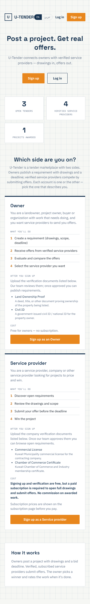 | 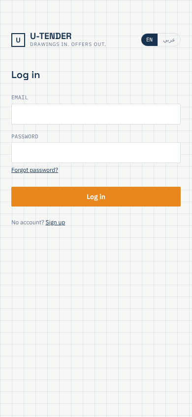 | 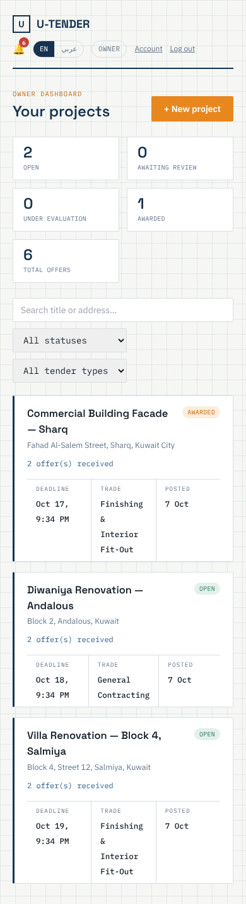 |

No page logged a script error. The only console messages were the expected "401 Unauthorized" checks made while signed out, and "400" responses to the deliberately invalid verification link.

## Issues found

| # | Screen | What the user saw | Reproduction | Severity | Fixed |
|---|---|---|---|---|---|
| 1 | Provider dashboard `/service-provider/dashboard` | **A completely blank page** for every service provider after logging in. React crashed with "Rendered more hooks than during the previous render." | Log in as any service provider | **Blocking** | **Yes** |
| 2 | Owner / provider status `/…/status` | A new account that hadn't submitted yet was sent here at its next login, saw "Application under review — Submitted <date>" next to "Action needed", and had no way back to **Verify your account**, so onboarding couldn't be finished | Sign up as an owner, leave without submitting, log in again | **Blocking** (onboarding) | **Yes** |
| 3 | Approved status pages | "Head to your dashboard" has no link | Log in as an approved owner, open `/owner/status` | Minor | No (logo works) |
| 4 | Login, sign-up, password forms | Labels aren't linked to their inputs (accessibility) | Inspect the form with a screen reader | Minor | No |

## Fixes made

1. **Provider dashboard crash** (`frontend/src/pages/service-provider/Dashboard.tsx`).
   - **Cause:** the summary-count query was declared after the early "loading" return, so React saw a different number of hooks once the profile loaded. This was introduced by an earlier Stage 5 follow-up commit.
   - **Fix:** moved that one query above the early return, gated on the profile.
   - **Other components:** a scan of every component for the same pattern found no other instance.
2. **Unfinished verification** (`frontend/src/pages/owner/Status.tsx` and `frontend/src/pages/service-provider/Status.tsx`).
   - **Fix:** an account that has never submitted (`incomplete`) is now sent to its **Verify your account** page instead of a status page claiming it's under review.
   - Submitted, approved, rejected and suspended accounts behave as before.

## Not tested

- **Completing a password reset and confirming an email address:** both need outgoing email.
- **Provider subscription and payment** (`/service-provider/subscribe`): needs a payment provider; outside this manual's scope.
- **Admin actions** (approve, edit, delete, suspend): deliberately not performed. Only navigation was checked.
- **Production URL and credentials:** this walkthrough used a local instance and demo accounts only.
